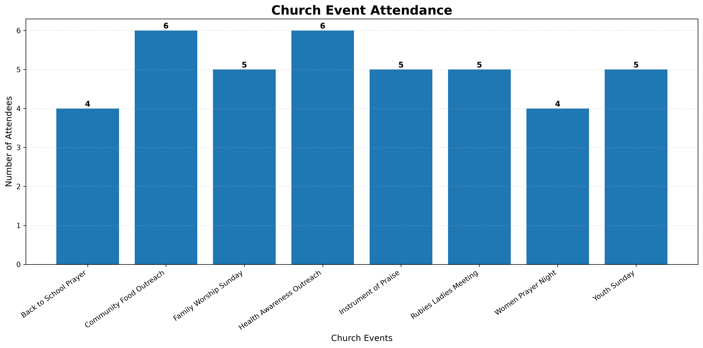

# 📊 Church Event Analytics Dashboard

## Dashboard Preview

## Overview

This project analyzes church event attendance using Python. It cleans raw data, merges multiple datasets, calculates key performance indicators (KPIs), generates an Excel report, and creates charts to help church leadership understand attendance trends and visitor engagement.

---

## Technologies Used

- Python
- pandas
- matplotlib
- Excel
- Git
- GitHub

---

## Features

- Import multiple CSV files
- Clean and prepare data
- Remove duplicate records
- Handle missing values
- Merge datasets
- Calculate attendance KPIs
- Calculate first-time visitor rates
- Generate automated Excel reports
- Create attendance charts

---

## Business Questions Answered

- Which event had the highest attendance?
- Which event attracted the most first-time visitors?
- Which event had the highest visitor rate?
- Which promotion channel performed best?
- How can attendance trends help improve future events?

---

## Project Files

- church_event_report.py
- events.csv
- attendance.csv
- church_event_report_v2.xlsx
- attendance_chart.png

---

## Skills Demonstrated

- Data Cleaning
- Data Transformation
- Data Analysis
- Data Visualization
- Business Reporting
- KPI Reporting
- Python Automation

---

## Future Improvements

- Interactive dashboard
- AI-generated executive summaries
- Power BI dashboard
- Automated email reports

---

Created by **Titilola Aminat Bakare**
